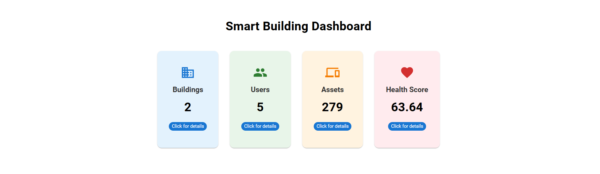
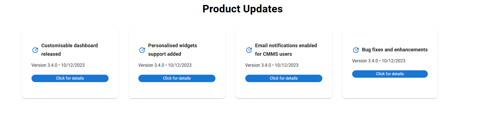
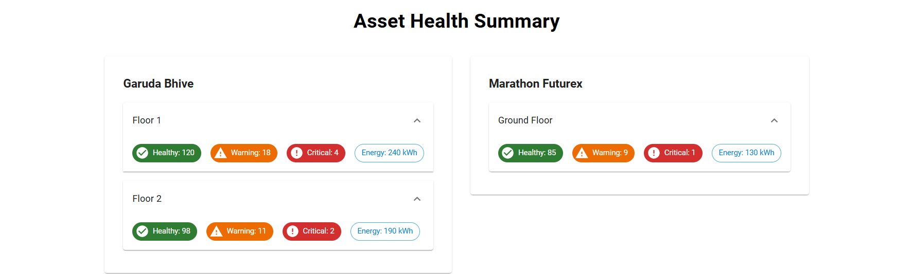
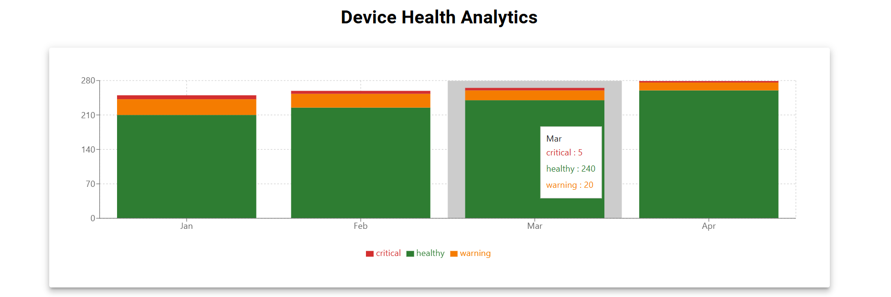
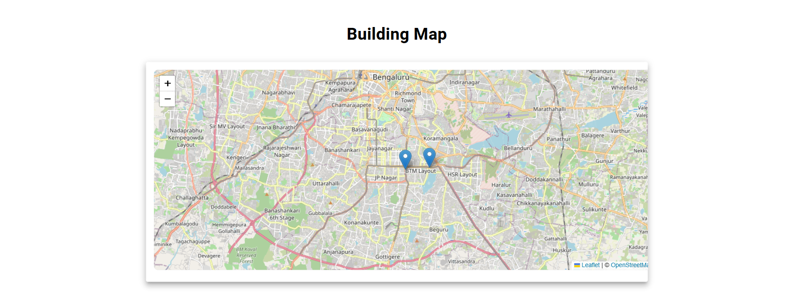

# Smart Building Admin Dashboard

A responsive admin dashboard for monitoring buildings, assets, users, and device health. Built with React.js and Material-UI.

---

## 🖥️ Live Demo
[View Live Dashboard](https://smart-dashboard-jade.vercel.app/)

---

## 📂 Project Structure
/src
  /components   - Dashboard widgets and reusable components
  /data         - JSON files simulating API responses
  /pages        - App pages
  App.jsx       - Main App component
/screenshots    - Screenshots of the dashboard (for README)

---

## ⚡ Features
- Organization Overview: Cards showing Buildings, Users, Assets, Health Score, with modal details.
- Product Updates: Timeline/cards with version, release date, skeleton loader, and modals for details.
- Asset Health Summary: Accordion per building, nested cards for floor-wise health, energy consumption.
- Device Health Analytics: Stacked bar charts showing device health trends over months.
- Interactive Building Map: Leaflet map with markers, popups showing building name, health score, and details.
- Responsive Design: Works on desktop, tablet, and mobile screens.
- Loading States: Skeleton loaders while fetching data from JSON.
- Accessibility Enhancements: ARIA labels and keyboard navigation.

---

## 🛠️ Setup Instructions
1. Clone the repository:
```bash
git clone https://github.com/Laxmipriya-coder/smart-dashboard.git

2.Navigate into the project folder
cd smart-dashboard

3.Install dependencies
npm install

4.Run the app
npm start

5.Open in browser
http://localhost:3000

✅ Your dashboard should now be running locally.


## 📷 Screenshots

**Organization Overview**


**Product Updates**


**Asset Health Summary**


**Device Health Analytics**


**Interactive Building Map**



Deployment

This app can be deployed using Vercel, Netlify, or GitHub Pages.

Recommended: Vercel for React projects.
Live link example: https://smart-dashboard-jade.vercel.app/


Technologies Used
React.js (Create React App)
Material-UI
Leaflet.js + OpenStreetMap
Recharts (for charts)
JavaScript / HTML / CSS

